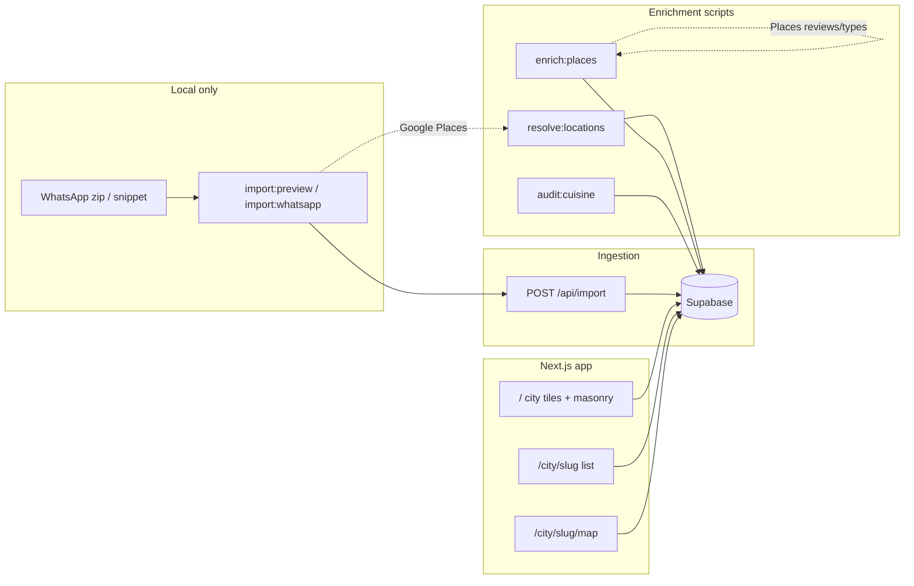

# Dastarkhwan Recommendations — agent guide

## Project goal

**Dastarkhwan Recommendations** is a community food notebook: curated place recommendations from a WhatsApp group (“Dastarkhwan”), browsable by city with maps, short editorial descriptors, and optional emotional quotes from the original messages.

Design intent:

- **Browse-first** — visitors discover cities and places without signing in.
- **Voice preserved** — testimonials (`note` / `snippet`) stay separate from factual place lines (`cuisine_summary`, types).
- **Privacy** — raw WhatsApp zips stay local; only cleaned rows land in Supabase.
- **Contributor gate (later)** — magic-link auth + invite codes before add/edit (implemented but hidden in public UI).

**Production:** https://dastarkhwan-reccs.vercel.app  
**Repo:** https://github.com/utkarsh348/dastarkhwan-reccs  
**Live ops checklist:** [`PROJECT_STATUS.md`](PROJECT_STATUS.md)

---

## Core tech

| Layer | Choice |
|--------|--------|
| App | **Next.js 16** App Router, React 19, TypeScript |
| Styling | **Tailwind CSS 4**, custom CSS in `src/app/globals.css` (warm cream/terracotta palette, Amiri + Fraunces + Geist) |
| Data | **Supabase** (Postgres, RLS, Auth magic links) |
| Maps | **Google Maps** — Places Details/Text Search (server), Maps JS + MarkerClusterer (client) |
| Import | Local **WhatsApp** parse (`jszip` + `_chat.txt`), optional **Ollama** JSON extraction |
| Validation | **Zod** API schemas, **Vitest** unit tests |
| Deploy | **Vercel** (`vercel.json`, env vars on platform) |

**Next.js note:** This repo uses Next.js 16 with breaking changes vs older docs. Before changing routing, caching, or middleware, read guides under `node_modules/next/dist/docs/` and heed deprecation notices (e.g. middleware → proxy migration).

---

## How it works (end-to-end)



### Data model (Supabase)

Main table: `recommendations`

- **Identity:** `restaurant`, `restaurant_slug`, `city`, `city_slug`
- **Location:** `latitude`, `longitude`, `google_place_id`, `google_maps_url`, `location_status`, `location_confidence`
- **Editorial:** `dishes[]`, `tags[]`, `cuisine_summary` (short “Known for …” / type line — **not** a testimonial)
- **Voice:** `note`, `snippet`, `source_name`, `confidence`
- **Provenance:** `recommendation_sources` (hash dedupe), `import_batches`

RLS: public **read** on recommendations; **writes** require authenticated contributor (see `supabase/migrations/002_auth_invites_rls.sql`).

### Browse UI (what ships today)

| Route | Behavior |
|-------|----------|
| `/` | Hero “From Dastarkhwan: tried and tasted”, city tiles, recent recommendations (masonry) |
| `/city/[citySlug]` | City list, List/Map tabs |
| `/city/[citySlug]/map` | `CityMap` + clustered pins |
| `/recommendation/[id]` | Detail card; edit UI only for contributors |

**`RecommendationCard`:**

- **Compact** — no quote; shows `cuisine_summary` only
- **Story** — blockquote via `getDisplayQuote()` (emotional filter in `src/lib/display-quote.ts`)
- No dish/tag chips on browse surfaces

**`AppNav`:** brand logo only (peacock quill PNG). No Cities / Sign in / Add recc / Search.

### Import pipeline

1. **`src/lib/importer/whatsapp.ts`** — parse `_chat.txt`, infer city context, list lines, `called X`, multi-place split (`multi-place.ts`)
2. **`src/lib/importer/ollama.ts`** — optional cluster extraction (env `IMPORT_USE_OLLAMA`, default on)
3. **`scripts/import-common.ts`** — merge, dedupe, optional geocode per candidate
4. **`POST /api/import`** — `importRecommendations()` with `source_hash` merge
5. **`src/lib/weak-content.ts`** — strip weak dishes/tags/notes; do not stuff Google labels into chips

### Location & place metadata

- **`src/lib/geocode.ts`** — Places text search + details; score by name/city; `query_place_id` URL support
- **`src/lib/enrich-location.ts`** — on create/update: resolve + `buildCuisineSummary()`
- **`src/lib/place-metadata.ts`** — Google types, reviews, editorial → `formatCuisineSummary()`
- **`src/lib/cuisine-summary.ts`** — **validate** summaries (reject testimonial phrasing, weak generics); `pnpm audit:cuisine` backfills DB

### Auth & contributors (implemented, UI hidden)

- Supabase magic link: `/login` → `/auth/callback`
- Invite codes (hashed with `INVITE_CODE_SALT`): `/join`, `pnpm invite:create`
- Middleware guards `/add`; API uses `requireContributorSession`
- Docs: [`docs/SUPABASE_AUTH_SETUP.md`](docs/SUPABASE_AUTH_SETUP.md)

---

## Key files (where to edit)

| Area | Paths |
|------|--------|
| Pages | `src/app/page.tsx`, `src/app/city/[citySlug]/**`, `src/app/recommendation/[id]/page.tsx` |
| Cards / map | `src/components/RecommendationCard.tsx`, `CityMap.tsx`, `CityTile.tsx` |
| Data access | `src/lib/recommendations.ts`, `src/lib/public-data.ts` |
| Types | `src/lib/types.ts`, `src/lib/api-schemas.ts` |
| Import | `src/lib/importer/*`, `scripts/import-*.ts` |
| Cuisine QA | `src/lib/cuisine-summary.ts`, `scripts/audit-cuisine-summaries.ts` |
| Schema | `supabase/schema.sql`, `supabase/migrations/*.sql` |
| Env | `src/lib/env.ts`, `.env.example` (never commit `.env.local`) |

---

## Intentionally disabled (public UI)

Code remains; restore by re-adding nav/components — see [`PROJECT_STATUS.md`](PROJECT_STATUS.md).

| Feature | Routes / code still present |
|---------|----------------------------|
| Sign in | `/login`, `AuthForm`, Supabase SSR |
| Add recommendation | `/add`, `RecommendationForm`, middleware |
| Search | `listRecommendations({ q })`, API — `SearchBox.tsx` deleted; re-add to home/city pages |
| Cities nav link | Removed from `AppNav`; brand links home |

Do not re-enable without product sign-off.

---

## Secrets & environment

- **Never commit API keys.** Use `.env.local` (gitignored) and Vercel env vars.
- **`.env.example`** — variable names only, empty secrets.
- **Never add** `mapskey*.txt` or paste keys into SQL, seed chat logs, or docs.
- Required vars: `NEXT_PUBLIC_SUPABASE_*`, `SUPABASE_SERVICE_ROLE_KEY`, `GOOGLE_MAPS_*`, `INVITE_CODE_SALT`, `IMPORT_TOKEN`

`pnpm setup:env` only writes non-secret defaults (`NEXT_PUBLIC_APP_URL`, placeholder `IMPORT_TOKEN`).

---

## Commands

```powershell
pnpm install
pnpm dev          # local app (needs .env.local)
pnpm test
pnpm lint
pnpm build
pnpm db:seed
pnpm import:preview "path\to\chat.zip"
pnpm import:whatsapp "path\to\chat.zip"
pnpm resolve:locations
pnpm enrich:places
pnpm audit:cuisine
pnpm invite:create --label="Community invite" --max=10
vercel --prod
```

---

## Agent conventions

1. **Minimize scope** — match existing patterns; no new UI libraries or features unless asked.
2. **Separate testimonial vs descriptor** — quotes in `note`/`snippet` + `display-quote.ts`; place lines in `cuisine_summary` via `cuisine-summary.ts` validation.
3. **Multi-place messages** — use `multi-place.ts` / extend gating; one row per restaurant.
4. **No chips on browse** — keep masonry cards clean (`RecommendationCard`, `CityMap`).
5. **Read `PROJECT_STATUS.md`** before deploy/ops tasks.
6. **Next.js 16** — consult in-repo docs before assuming App Router APIs from training data.

---

## Cleanup & tech-debt backlog

Prioritized work that is **not** done or only partially done. Use this when planning refactors; update this section when items close.

### P0 — Product / data quality

- [ ] **Re-enable contributor UI** — `AppNav` links for Sign in + Add recc; polish `/add` and onboarding copy.
- [ ] **Import pipeline hardening** — multi-place gating on all message shapes; Ollama prompt = one restaurant per object; run `audit:cuisine` after every bulk import.
- [ ] **Cuisine summary gaps** — several rows have `null` `cuisine_summary` after audit (Araby's, Curries, Moi, etc.); manual dish tags or better Google type fallbacks.
- [ ] **Map coverage** — resolve **Lolo Roso** (`needs_lookup`); verify Parimal Garden, SG Road Food Truck Park pins.

### P1 — UX (disabled features)

- [ ] **Search** — restore `SearchBox` on `/` and `/city/[citySlug]`; define search scope (name vs note vs city).
- [ ] **README / routes doc** — README still mentions search and nav features that are disabled; keep in sync with UI.

### P2 — Platform / ops

- [ ] **Supabase Auth redirect URLs** — confirm production/preview URLs in dashboard ([`docs/SUPABASE_AUTH_SETUP.md`](docs/SUPABASE_AUTH_SETUP.md)).
- [ ] **Rotate `IMPORT_TOKEN`** on Vercel if still default from `.env.example`.
- [ ] **`SUPABASE_SERVICE_ROLE_KEY` on Vercel Preview** — if using preview deployments.
- [ ] **Next.js middleware deprecation** — migrate `src/middleware.ts` to proxy convention when upgrading.

### P3 — Code health

- [ ] **Remove dead CSS** — `.nav-links` rules if nav stays logo-only; old search styles already removed.
- [ ] **Lint warnings** — unused vars in `weak-content.ts` / `weak-content.test.ts`.
- [ ] **Windows dev stability** — `next.config.ts` uses `experimental.cpus: 1`; document OOM workaround (`pnpm build` + `pnpm start`).
- [ ] **Consolidate seed paths** — `data/seed.sql`, `seed-part-*.sql`, `seed-database.mjs`, `import-preview.json` (gitignored) — document single source of truth.
- [ ] **Favicon / logo** — optional transparent PNG for circular `brand-mark`; replace default `favicon.ico`.

### P4 — Future architecture

- [ ] **Wire `buildCuisineSummary()` everywhere** — import and enrich always validate; no testimonial “Known for” in DB.
- [ ] **Editorial pass** — weak list-only snippets (e.g. “1. Gordhan Thal”) vs story cards.
- [ ] **Duplicate / typo rows** — Gordon Thal vs Gordhan Thal merge policy.
- [ ] **Rate-limit & monitor** Google Places usage on enrich/resolve scripts.

---

## Related docs

- [`PROJECT_STATUS.md`](PROJECT_STATUS.md) — live deploy state, disabled features table, ops
- [`README.md`](README.md) — human setup (may lag UI; prefer this file for agents)
- [`docs/SUPABASE_AUTH_SETUP.md`](docs/SUPABASE_AUTH_SETUP.md) — auth redirect checklist

<!-- BEGIN:nextjs-agent-rules -->
# This is NOT the Next.js you know

This version has breaking changes — APIs, conventions, and file structure may all differ from your training data. Read the relevant guide in `node_modules/next/dist/docs/` before writing any code. Heed deprecation notices.
<!-- END:nextjs-agent-rules -->
