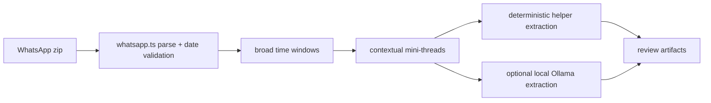

# Dastarkhwan Project Status

## Live Site

- Production: https://dastarkhwan-reccs.vercel.app
- Production data remains unchanged during extraction work.
- Browse UI is public read-only: city tiles, recommendation cards, city list, and map views.

## Current Extraction Pipeline

The active local pipeline is the WhatsApp-only contextual preview flow.

```powershell
pnpm extract:preview "data\WhatsApp Chat - Dastarkhwan.zip"
```

It writes review artifacts only under `data/extraction-runs/<run-id>/`:

- `summary.json`
- `candidates.json`
- `review.csv`
- `rejected.json`
- `clusters.json`

No Supabase writes, Vercel deploys, or Google Maps calls happen during preview.

### Current Full-Chat Run

Run id: `contextual-full-2026-06-01`

| Metric | Count |
| --- | ---: |
| Parsed messages | 3,760 |
| Broad clusters | 276 |
| Mini-threads | 582 |
| Accepted review candidates | 133 |
| Rejected/parked threads | 570 |

City distribution:

| City | Count |
| --- | ---: |
| Bengaluru | 66 |
| Ahmedabad | 32 |
| Mumbai | 17 |
| Unsorted | 8 |
| Srinagar | 3 |
| Kolkata | 2 |
| Chandigarh | 2 |
| Jaipur | 2 |
| Mysuru | 1 |

Confidence bands:

| Band | Count |
| --- | ---: |
| likely_importable | 5 |
| review_required | 128 |
| rejected | 0 accepted rows |

Notes:

- The old random Srinagar concentration is gone.
- The run is a fuller review set, not final import data.
- Ollama processed the first checkpointed slice slowly; the remaining run was completed deterministically with checkpoint resume.
- Deterministic output still contains false positives and dish/category rows that need review before import.

## Pipeline Architecture



Core files:

- `scripts/extract-preview.ts`
- `src/lib/importer/contextual.ts`
- `src/lib/importer/whatsapp.ts`
- `src/lib/importer/whatsapp-heuristic.ts`
- `src/lib/importer/dedupe.ts`
- `src/lib/importer/schemas.ts`

Old `window-v2` / `session-v1` importer scripts and modules have been removed as active pipeline options.

## Intentionally Disabled In Public UI

These remain hidden from the header/pages while flows are refined:

| Feature | Still in codebase | Re-enable when |
| --- | --- | --- |
| Sign in / Account | Auth, magic link, `/auth/callback` | Contributor sign-in is ready for public use |
| Add recc | `/add`, `POST /api/recommendations` | Invite/auth flow is polished |
| Search | API/data query support | Search UX is defined |

## Next Data Step

Review `data/extraction-runs/contextual-full-2026-06-01/review.csv` and `candidates.json`.

Before any import:

1. Remove obvious false positives.
2. Confirm whether dish-only rows should become topic tags or be dropped.
3. Approve a clean `RecommendationInput[]` set.
4. Only then feed approved rows into the import API.

Do not run import or deploy commands until review approval:

```powershell
pnpm import:whatsapp
vercel
vercel --prod
```

## Secrets And Local Data

No API keys belong in the repo. Use `.env.local` and Vercel env vars only.

Gitignored local-only data includes raw WhatsApp zips/text, parsed chat, extraction runs, checkpoints, logs, preview JSON, review CSVs, and LLM failure logs.

Required env var names are listed in `.env.example`.

## Verification

Use:

```powershell
pnpm test
pnpm lint
pnpm build
```
